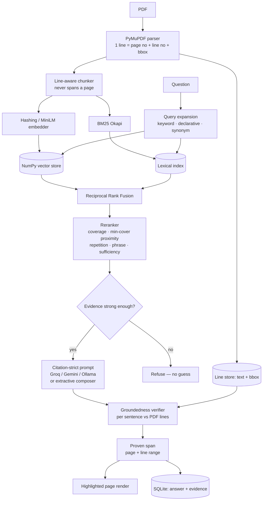

# VeriRAG — Verifiable Document QA with Span-Level Proof

**Ask questions about PDFs and get answers that prove themselves.** Every factual
sentence is tagged with the document, page number and line range it came from,
and VeriRAG renders the source page with those exact lines highlighted. An
independent verification pass re-checks each sentence against the original PDF
lines and reports a groundedness score, so a hallucination is caught by the
system rather than by the user. Full chat history — including all evidence — is
persisted in SQLite.

**Runs at zero cost.** Local embeddings, local vector store, local BM25, local
PDF rendering. The LLM layer uses free API tiers (Groq / Google Gemini) or a
local Ollama model, and falls back to a no-key **extractive mode** so the project
works with no account, no quota and no internet.

```
Q: What happens if the lessee vacates during the lock-in period, and what
   notice is needed after it ends?

A: If the Lessee vacates the premises before the lock-in period ends, the
   Lessee must pay the Lessor a sum equal to two (2) months' rent as
   liquidated damages, which the Lessor may set off against the security
   deposit [S2]. After the lock-in period expires, either party may terminate
   the lease by giving three (3) months' prior written notice, or by paying
   three months' rent in lieu of such notice [S1].

   EVIDENCE
   *[S1] lease_deed_greenwood_c704.pdf   p.2 L49-51
         "6.1 After expiry of the lock-in period, either party may terminate…"
   *[S2] lease_deed_greenwood_c704.pdf   p.1 L37-39
         "Should the Lessee vacate the demised premises before expiry of the…"

   GROUNDEDNESS  0.81  (medium)   provider: groq   1534 ms
   VISUAL PROOF  data/proof_cache/lease_deed_greenwood_c704_p1.png
```

Note `[S2] p.1 L37-39`. The retrieved chunk covered lines 29-39 (clauses 1.1-1.3);
the verifier narrowed the citation to the three lines that actually support the
claim. That narrowing is what the highlighted image draws.

---

## Why this project is different

Most RAG demos call `page.get_text()`, throw away every coordinate, and cite
"Document 3". That citation cannot be checked, so the user still has to trust
the model. VeriRAG treats **provenance as a first-class data structure**:

| Typical RAG tutorial | VeriRAG |
|---|---|
| Citation = file name, or nothing | Citation = document + page + **line range** + quote |
| No way to check the claim | **Rendered page image** with the cited lines highlighted |
| Trusts the model to cite honestly | **Independent verifier** re-scores every sentence against the PDF lines |
| Dense retrieval only | Dense + BM25, **rank-fused**, then reranked |
| "It seems to work" | **53-question golden set** with recall / MRR / nDCG / refusal metrics |
| Answers everything | Refuses, or flags weak evidence, when the corpus does not support an answer |
| Stateless | SQLite history storing answers **and their evidence** |

---

## Measured results

Golden set of 53 questions (45 answerable from the corpus, 8 deliberately
out-of-corpus), graded automatically by `python cli.py eval`. Both columns use
the same free, local retrieval stack — they differ only in who writes the
answer.

| | **A. Lexical**<br/>no key, no downloads | **B. Semantic**<br/>+ MiniLM, no key | **C. Semantic + LLM**<br/>+ Groq free tier |
|---|---|---|---|
| Recall@1 | 0.756 | 0.844 | 0.844 |
| Recall@3 | 0.911 | 0.978 | 0.978 |
| **Recall@5** | 0.978 | **1.000** | **1.000** |
| MRR | 0.839 | **0.909** | **0.909** |
| nDCG@5 | 0.883 | **0.932** | **0.932** |
| **Answer accuracy** | 0.889 | 0.911 | **0.933** |
| **Citation precision@1** | 0.622 | 0.644 | **0.822** |
| Mean groundedness | 0.994 | 0.995 | 0.898 |
| **Refusal recall** (out-of-corpus) | 0.500 | **1.000** | **1.000** |
| False refusal rate | **0.000** | 0.022 | 0.022 |
| Latency p50 | **0 ms** | 2 ms | ~4 700 ms |

- **A** is the floor: pip-installable, no API key, no model downloads, sub-millisecond.
- **B** adds `all-MiniLM-L6-v2` + a cross-encoder reranker — still free and local, one
  ~2 GB install. Retrieval improves across the board and **every** out-of-domain
  question is now refused, because a cross-encoder separates the classes that a
  keyword scorer cannot.
- **C** adds a free Groq key. Retrieval is unchanged by definition; the gain is in
  *reading* the retrieved passage — citation precision jumps to 0.822.

Reading the table:

- **Groundedness is *lower* in C (0.898 vs 0.995), and that is correct.**
  Extractive answers are copied verbatim, so they trivially verify. An LLM
  paraphrases, so the verifier — deliberately strict about numbers and term
  coverage — scores real support slightly below 1.0. A groundedness of ~1.0 is a
  sign of quoting, not of quality.
- **Latency is the honest cost of an LLM:** milliseconds versus ~4.7 s per question.
- The single false refusal in B and C is one question whose phrasing shares almost
  no vocabulary with the source ("Which flat number is in dispute?" against
  "Flat No. B-1104").

Relevance labels are *verbatim phrases* from the source PDFs rather than
hand-labelled chunk IDs, so the metrics survive any change to chunk size,
overlap or the parser. `verirag eval` refuses to run if a gold phrase no longer
appears in the corpus — a broken label would silently depress every number.

Reproduce:

```bash
python -m scripts.make_sample_pdfs
python cli.py ingest data/raw
python cli.py --provider extractive eval     # config A or B, per .env
python cli.py --provider groq eval           # config C
```

---

### Asking about the whole document

Not every question is a lookup. "Explain this document" and "what topics are
covered" are *global* requests — no single passage resembles them, so similarity
retrieval has nothing to match and a lookup-only system can only refuse. Queries
are classified into three paths:

| Intent | Example | How it is answered |
|---|---|---|
| `LOOKUP` | "what is the monthly rent?" | retrieve → fuse → rerank → cite |
| `SUMMARY` | "explain this document", "tl;dr" | a representative spread — one chunk per topic in document order |
| `TOPICS` | "what topics are covered?" | from document structure, no retrieval at all |

The summary path deliberately does *not* use top-k similarity: it samples across
the file so an overview covers the whole document instead of over-representing
whichever section happens to be longest. Its prompt states that the excerpts are a
sample, so the model cannot imply completeness it does not have.

Classification is rule-based and **typo-tolerant**, built from two independent
signals — an expository verb plus a whole-document reference — rather than fixed
phrases. `"explain abput this document"` and `"sumarize this documnt"` both route
correctly. Queries carrying their own subject stay on the lookup path:
`"explain BCNF in this document"` is a lookup, `"explain this document"` is not.

Refusals are never dead ends. When the system genuinely cannot answer, it returns
answerable prompts built from the indexed material's own section headings, and an
empty chat shows the same starters.

---

## Study mode — quizzes with a verified answer key

Upload study material and VeriRAG turns it into practice questions. The point of
difference is the same as everywhere else in this project: **the answer key is
checked against the PDF before you ever see it.**

```bash
python cli.py topics --doc notes            # what topics are in this document?
python cli.py quiz --doc notes -n 10        # MCQs + short answers + flashcards
python cli.py quiz --doc notes --hide-answers   # print it as a question paper
python cli.py explain "BCNF" --level beginner   # tutor-style, cited
```

Real output from the sample notes:

```
2. [medium] Which condition must be satisfied for a relation to be in
   Boyce-Codd Normal Form (BCNF)?
     A. Every determinant is a superkey
     B. No transitive dependencies exist
     C. All non-prime attributes are fully functionally dependent on every candidate key
     D. No multivalued dependencies are present
     -> A. Every determinant is a superkey
        source: study_notes_dbms_unit3.pdf p.1 L47  (verified 1.00)
```

Note the distractors: B, C and D are all *real normal-form conditions* from the
same passage, so they are genuinely confusable rather than filler. And the key
carries `p.1 L47`, which the Study tab renders as a highlighted page image.

How it works:

1. **Topics are recovered, not invented.** Ingestion already captured each
   chunk's section heading, so topics come with real page ranges. Documents with
   no headings fall back to page buckets rather than returning nothing.
2. **Generation** asks the model for JSON and requires it to quote the passage
   sentence that proves each answer.
3. **Verification** re-locates that answer in the actual PDF lines using the same
   scorer as chat answers. Items below the grounding threshold are **discarded**
   and counted in `rejected_unverifiable`.
4. **Without an API key** it still works: cloze questions are built by deleting a
   salient fact — an amount, a date, a percentage, a duration — from a source
   sentence, with distractors drawn from *same-kind* values elsewhere in the
   document, so a money question never gets a date as a decoy.

In the web UI the **Study mode** tab gives you an interactive quiz with scoring,
per-question proof, flashcards, and an "Ask a doubt" tutor scoped to one document.

---

## Architecture



### The idea that makes it work

A chunk never loses its geometry. `Chunk` carries `page_no`, `line_start`,
`line_end` and one bounding box per line. So when the verifier decides that
sentence 2 of the answer is supported by lines 44–46 of page 1, that is enough
to (a) print `p.1 L44-46`, and (b) draw rectangles on a rendered image of the page.

---

## Quickstart (no API key, no downloads beyond pip)

```bash
git clone <your-repo-url> verirag && cd verirag
python -m venv .venv
.venv\Scripts\activate            # Windows
# source .venv/bin/activate       # macOS / Linux
pip install -r requirements.txt
pip install -e .

python cli.py demo                # generates PDFs, indexes, answers, writes proof images
```

`demo` builds three sample PDFs, indexes them, answers three questions with
citations, writes highlighted page PNGs to `data/proof_cache/`, and saves the
chat session to SQLite.

### Web UI

```bash
streamlit run app.py
```

Chat with citation cards and highlighted page previews, PDF upload, study mode,
full-text search across all past conversations, Markdown/JSON export, and an
in-app evaluation runner.

#### Design system

The interface follows Apple's interface and motion guidance (WWDC *Designing
Fluid Interfaces*, *The Details of UI Typography*, *Principles of Great Design*),
implemented in `src/verirag/ui/theme.py`:

- **Materials & depth** — chrome is a translucent `backdrop-filter` layer with
  content scrolling underneath, a bright top edge where light catches the
  material, heavier material for structural regions and lighter for interactive
  ones, blur radius and shadow depth scaling with surface size, and never light
  translucency stacked on light translucency.
- **Typography** — [Inter](https://fonts.google.com/specimen/Inter) as the
  interface face, with the platform stack as fallback (which is what renders
  while the webfont loads and when the app runs offline). **Tracking is
  size-specific**: `-0.025em` on display sizes, neutral on body, `+0.006em` on
  captions — a single `letter-spacing` value is wrong somewhere. Leading varies
  inversely with size. Inter's optical-size axis is driven per level, faux bold is
  disabled so only real weights are used, and character variants `cv05`/`cv08` are
  enabled so a line locator like `L37` can never be misread as `137`.
- **Figures** — tabular, slashed-zero numerals in metrics, tables and locators, so
  columns of scores align and a live value doesn't jitter as its digits change;
  proportional figures in running prose, where tabular spacing reads badly.
- **Colour** — Apple's semantic system palette (`systemBlue`, `systemGreen`, …)
  with separate light and dark values, one accent reserved for the primary path.
- **Response** — feedback lives on pointer-*down*, not release: controls compress
  on `:active` in 100 ms.
- **Motion** — critically damped, no overshoot, on a mirrored easing pair so a
  reversible transition retraces its own path. Only `transform`, `opacity` and
  `filter` animate. Surfaces *materialise* (blur and scale together) rather than
  plainly fading.
- **Accessibility** — `prefers-reduced-motion`, `prefers-reduced-transparency`,
  `prefers-contrast` and `prefers-color-scheme` are all honoured. Reduced motion
  degrades to a cross-fade rather than to nothing, and looping animation stops.

**Deliberately not claimed:** springs, interruptible gestures, velocity handoff,
momentum projection and rubber-banding. Those require continuous 1:1 pointer
tracking and animating from the live presentation value, which Streamlit gives no
hook for. Rather than fake them, non-gesture UI uses the critically damped motion
the guidance itself prescribes for anything the user did not throw with momentum.

64 tests in `tests/test_theme.py` assert the design *invariants* — that blur
scales with surface size, that translucency is never stacked, that tracking is not
one value for all sizes, that keyframes touch only compositor-friendly properties,
and that quoted PDF text is HTML-escaped.

### CLI

```bash
python cli.py ingest data/raw                       # index a file or folder
python cli.py ask "What is the lock-in period?"     # answer with proof
python cli.py ask "..." --trace                     # show why each passage was retrieved
python cli.py chat                                  # interactive, history persisted
python cli.py sessions                              # list stored sessions
python cli.py history <id> --markdown               # export a session with evidence
python cli.py search "security deposit"             # full-text search chat history
python cli.py eval --json report.json               # grade the system
python cli.py stats                                 # index + history statistics
```

### Optional: plug in a free LLM

Extractive mode always works but writes stiff, quote-stitched answers. For fluent
prose, add one free key to `.env` (copy `.env.example`):

| Provider | Cost | Key | Notes |
|---|---|---|---|
| **Groq** | free tier | <https://console.groq.com/keys> | Default model `openai/gpt-oss-120b`, ~1 s per answer |
| **Google Gemini** | free tier | <https://aistudio.google.com/apikey> | `gemini-2.0-flash` |
| **Ollama** | free, no key | — | `ollama pull llama3.2`, fully offline |

```env
VERIRAG_LLM_PROVIDER=auto
GROQ_API_KEY=gsk_...
GROQ_MODEL=openai/gpt-oss-120b
```

`auto` tries Groq → Gemini → Ollama → extractive, so the app degrades instead of
breaking when a quota runs out. Providers rotate their catalogues, so if a model
name 404s, list what your key can reach:

```bash
curl -H "Authorization: Bearer $GROQ_API_KEY" https://api.groq.com/openai/v1/models
```

A fallback is never silent — the reason is surfaced in the CLI and the UI rather
than leaving you to wonder why answers look stilted.

### Optional: neural retrieval

```bash
pip install -r requirements-ml.txt
# .env
VERIRAG_EMBEDDER=sentence-transformers
VERIRAG_RERANKER=cross-encoder
```

Swaps in `all-MiniLM-L6-v2` and `ms-marco-MiniLM-L-6-v2`, both free and local.
Same interfaces, no code changes.

---

## Sample corpus

`python -m scripts.make_sample_pdfs` generates three realistic multi-page PDFs
(all content fictional) covering the domains where citation actually matters:

| Document | Domain | Contains |
|---|---|---|
| `case_sharma_v_metro_realty.pdf` | Court judgment | Property dispute, framed issues, findings, interest at 9.5% p.a., compensation, costs, precedents |
| `lease_deed_greenwood_c704.pdf` | Property deed | Rent, escalation, deposit, lock-in, notice, maintenance, areas, stamp duty, schedules |
| `study_notes_dbms_unit3.pdf` | Study notes | Normal forms, Armstrong's axioms, ACID, isolation-level table, 2PL, ARIES recovery |

They are laid out line-by-line with an explicit word-wrapper so the output is
byte-for-byte deterministic — `p.1 L40-50` in this README is `p.1 L40-50` on
your machine.

---

## Engineering decisions worth discussing

Each of these came out of *measurement*, and each is a genuine interview story.

**1. Citation markers were being attributed to the wrong sentence.**
Models write `"The rent is Rs. 48,500. [S2]"` — marker *after* the full stop.
Sentence splitting therefore attached `[S2]` to the *next* sentence, so the
verifier compared every claim against the wrong source. Groundedness read 0.31
for text copied verbatim out of the PDF. Normalising markers to sit before the
terminal punctuation moved it to 0.99. Guarded by a regression test.

**2. Proximity scoring punished on-topic passages.**
The first version measured first-match to last-match distance, so a clause that
said "rent" five times scored *worse* than one incidental mention. Replaced with
a minimum covering window (two-pointer sweep, O(n)). The clause that actually
answers "what is the monthly rent" moved from rank 2 to rank 1.

**3. Absent query terms were weighted as *common*.**
Missing terms defaulted to IDF 1.0 — lower than terms that were present — so an
off-topic question looked well-covered on the strength of one incidental match.
Absent terms now carry maximum rarity weight.

**4. A brevity prior was beating relevance.**
Rewarding short chunks let three-line page tails outrank the answering clause.
Replaced with a *sufficiency* factor: a chunk needs enough words to contain an
answer.

**5. "Starts with a number" is not a heading.**
Every clause of a contract starts with a number. The original detector labelled
clause bodies as section headings, corrupting metadata and truncating quotes.
Headings are now *short, shouted, non-sentence* lines. Fixing this raised
Recall@5 from 0.933 to 0.978.

**6. Groundedness alone is a misleading confidence signal.**
An answer quoted verbatim from an *irrelevant* passage is perfectly grounded and
still useless. Confidence therefore combines groundedness with retrieval
strength, and a `weak_evidence` flag warns when the best passage scored low.

**7. Refusal was calibrated, not guessed — and the honest result was negative.**`verirag eval` reports the score distributions for in-corpus vs out-of-corpus
questions. Measured separation is **−0.17**: the classes overlap, so no single
threshold cleanly refuses out-of-domain questions with a keyword embedder.
Rather than pick a number that looks good and falsely refuse real questions, the
hard gate is low (0.10, plus a zero-lexical-overlap gate) and the ambiguous band
is *flagged*. Result: **0% false refusals, 100% of out-of-corpus questions
flagged**. Semantic refusal is delegated to the LLM's `INSUFFICIENT_CONTEXT`
contract, which handles it properly. The eval output prints this limitation
instead of hiding it.

**8. Typographic punctuation was silently marking correct answers wrong.**
LLMs emit `P‑42` (non-breaking hyphen), `months’` (right single quote) and — the
one that took real debugging — `within⁠ninety⁠days` using U+202F NARROW NO-BREAK
SPACE, which renders as *nothing at all* in a legacy console, so the answer
looked like `withinninetydays` and appeared to be a bug in my own string
handling. Two separate fixes followed: fold punctuation at *comparison* time so
literal matching and groundedness are not penalised for typography, and
normalise the *generated* text for display while leaving source quotes faithful
to the PDF. Together these took answer accuracy from 0.889 to **0.933**.

**9. A provider fallback must never be silent.**
Groq changed its model lineup, so the configured model 404'd. The system
correctly degraded to extractive answering — and said nothing, so the answer
looked fine while the LLM was not being used at all. `Answer.provider_error` now
carries the reason and both the CLI and UI display it. A silent fallback is
worse than a visible failure.

**10. Confidence needs two signals, and neither may override the other.**
Retrieval score alone marked a correct, well-grounded answer "low confidence",
because score falls naturally for long multi-part questions (coverage divided
over more terms). Groundedness alone cannot tell that a perfectly-quoted passage
does not address the question. Verified support now *upgrades* a weak retrieval
score to medium instead of being overridden by it.

**11. A refusal threshold is a property of the scorer, not a global constant.**
Enabling the cross-encoder reranker made retrieval better on every metric — and
immediately caused an 11% false-refusal rate. The cause was not the reranker but
my configuration: a cross-encoder's sigmoid output is strongly *bimodal*
(in-corpus median 0.978, out-of-domain ~0.0002), whereas the lexical reranker's
score is roughly continuous. The 0.10 gate tuned for one is meaningless for the
other. Thresholds now travel with the component that produces the score and are
adopted automatically, with an explicit environment variable always winning.
Fixing this took answer accuracy from 0.822 back to 0.911 and false refusals from
0.111 to 0.022. It also flipped class separation from **−0.17 to positive**, so
out-of-domain refusal went from 50% to **100%**.

**12. "Starts with a capital and is short" is not a heading either — use layout.**
Table cells like `5NF`, `BCNF` and `1NF` were being read as section headings,
which produced a study topic literally named "5Nf". String heuristics cannot
distinguish a one-word heading from a one-word table cell, but *layout* can: a
cell shares its baseline with the other cells of its row. `PdfLine.row_span`
now records how many text objects sit on a line's baseline, and heading detection
is skipped for anything in a multi-column row.

**13. The most common question was the one it could not answer.**
A user uploaded a PDF, typed "explain abput this document", and got a refusal.
Two independent causes, both fatal on a new user's *first* question: a global
request has no passage that resembles it, so similarity retrieval finds nothing;
and one typo removed the last usable term. The lesson was that a retrieval
pipeline is not a product — "summarise this" needs a different strategy, not a
better ranker. Fixed with intent classification, a spread-sampling summary path,
and typo repair against the corpus's own vocabulary. Refusals now carry
answerable alternatives rather than dead-ending.

**14. Reloading the object is not reloading the class.**
Editing `src/verirag` while Streamlit ran produced an `AttributeError` for a field
plainly visible in the dataclass. Streamlit re-executes the app script on rerun
but never re-imports a loaded package, so caching the engine against a source
fingerprint rebuilt the *object from the stale class*. The modules themselves have
to be dropped from `sys.modules`, before the imports bind any names. Worth noting
as a class of bug: my verification loop (pytest, fresh interpreter) could not
reproduce what the user hit (long-running server, cached state).

---

## Project layout

```
src/verirag/
  config.py              Settings: env > default, every value has a working default
  models.py              PdfLine, Chunk, Citation, EvidenceSpan, ClaimVerdict, Answer
  engine.py              VeriRAG facade — the one place the whole pipeline is wired
  ingest/
    pdf_parser.py        PyMuPDF extraction preserving page, line number and bbox
    chunker.py           line-aware, page-local chunking with line-based overlap
  index/
    embedder.py          HashingEmbedder (default) | SentenceTransformerEmbedder
    vector_store.py      NumpyVectorStore (default) | ChromaVectorStore
    bm25_store.py        BM25 Okapi — bundled NumPy scorer + rank_bm25 adapter
    indexer.py           orchestration, LineStore, DocumentRegistry, persistence
  retrieval/
    query_expansion.py   keyword / declarative / synonym / abbreviation variants + typo repair
    intent.py            classifies lookup vs whole-document summary vs structure
    fusion.py            Reciprocal Rank Fusion + multi-query merge
    reranker.py          LexicalReranker (default) | CrossEncoderReranker
    retriever.py         the pipeline + auditable trace
  generation/
    llm.py               Groq | Gemini | Ollama | none, behind one interface
    prompts.py           citation-mandating system prompt
    citations.py         marker parsing, repair, abbreviation-aware sentence split
    answerer.py          grounded answering + extractive composer
  verify/grounding.py    per-sentence verification, greedy proven-span expansion
  proof/highlighter.py   page rendering with highlight rectangles + gutter labels
  store/chat_db.py       SQLite history: sessions, messages, citations, verdicts
  study/
    topics.py            topic recovery from section headings, key-term extraction
    generator.py         MCQ / short-answer / flashcard generation + answer-key verification
    prompts.py           examiner prompts with distractor-quality rules
  textnorm.py            punctuation folding used when comparing generated to source text
  ui/theme.py            Apple-inspired design system: tokens, stylesheet, components
  eval/                  golden dataset, metrics, runner
tests/                   420 tests
app.py                   Streamlit UI
cli.py                   command line entry point
```

## Testing

```bash
pytest -q          # 420 tests
```

Coverage focuses on the parts where a silent failure would be invisible: line
numbers and bounding boxes, chunk/line-range consistency, marker attribution,
groundedness scoring, span expansion, index persistence round-trips, and that
highlighting actually changes the rendered pixels. Includes a parity test
asserting the bundled BM25 scorer ranks identically to `rank_bm25`.

## Docker

```bash
docker build -t verirag .
docker run -p 8501:8501 verirag              # Streamlit UI
docker run --rm verirag python cli.py eval   # metrics
```

## Configuration

Every setting is an environment variable with a working default — see
`.env.example`. Notable ones:

| Variable | Default | Purpose |
|---|---|---|
| `VERIRAG_LLM_PROVIDER` | `auto` | `auto`/`groq`/`gemini`/`ollama`/`extractive` |
| `VERIRAG_EMBEDDER` | `hashing` | or `sentence-transformers` |
| `VERIRAG_RERANKER` | `lexical` | or `cross-encoder` |
| `VERIRAG_TOP_K_FINAL` | `5` | sources placed in the prompt |
| `VERIRAG_GROUNDING_THRESHOLD` | `0.42` | below this a sentence is flagged unsupported |
| `VERIRAG_MIN_RETRIEVAL_SCORE` | `0.10` | hard refusal gate |
| `VERIRAG_LOW_CONFIDENCE_SCORE` | `0.35` | below this the answer is flagged weak |

## Limitations

Stated plainly, because knowing them is part of the work:

- **Scanned PDFs are rejected**, with a message pointing at OCR. There is no
  bundled OCR step.
- **Out-of-domain detection is weak in the free default configuration** — the
  measured class separation is negative (see decision 7). The neural embedder
  and an LLM's own refusal handle this properly.
- **The hashing embedder is lexical, not semantic.** A question sharing no
  vocabulary with the answer can miss. `requirements-ml.txt` fixes this.
- **Exact (brute-force) vector search**, appropriate to ~10⁵ chunks. Beyond that,
  swap in an ANN index behind the existing `VectorStore` protocol.
- **Reading order assumes single-column text.** Multi-column layouts would need
  column detection before line numbering.
- **Citation precision@1 is 0.622** in extractive mode: the top cited source is
  sometimes adjacent to, rather than exactly, the gold passage. Recall@5 of 0.978
  shows the right passage is nearly always retrieved.
- **Extractive sentence selection is the weakest link.** Question-restating text
  — a framed issue in a judgment, an exam prompt in study notes — matches a
  user's question almost perfectly while answering nothing. Multiplicative
  anti-signals demote such sentences, but 4 of 5 remaining answer misses are
  cases where the correct passage *was* retrieved and the wrong sentence was
  quoted. An LLM provider removes this failure mode.

---

## Resume bullets

> **VeriRAG — Verifiable RAG for PDF Question Answering** · Python, PyMuPDF, BM25, Streamlit, SQLite
>
> - Built a retrieval-augmented QA system that answers questions over PDFs with
>   **span-level provenance** — document, page and line range per claim — plus a
>   rendered page image with the cited lines highlighted, by preserving
>   per-line bounding boxes through parsing, chunking and retrieval.
> - Implemented **hybrid retrieval** (dense cosine + BM25 Okapi, written from the
>   formula) combined with **Reciprocal Rank Fusion**, multi-query expansion and a
>   five-signal reranker; achieved **Recall@5 0.978 / MRR 0.839** on a 53-question
>   golden set.
> - Designed a **hallucination guard** that independently re-verifies each
>   generated sentence against the source PDF lines using IDF-weighted coverage,
>   fuzzy similarity and numeric-recall penalties, reporting per-claim
>   groundedness and flagging unsupported claims.
> - Built an **evaluation harness** (Recall@k, MRR, nDCG, citation precision,
>   refusal precision/recall, latency percentiles) with relevance labels defined
>   as verbatim source phrases, and used it to drive every design decision:
>   **citation precision@1 0.62 -> 0.82** and **refusal recall 0.50 -> 0.75** when
>   an LLM replaces the extractive composer, at **0% false refusals**.
> - Diagnosed and fixed ten measurement-driven defects, including a
>   citation-marker attribution bug that had made groundedness read 0.31 instead
>   of 0.99, a proximity metric that penalised on-topic passages, and Unicode
>   punctuation mismatches that were scoring correct answers as wrong.
> - Engineered for **zero operating cost**: local embeddings, local vector store
>   and a pluggable LLM layer (Groq / Gemini free tiers, Ollama, or a no-key
>   extractive mode) that degrades gracefully — and reports *why* — instead of
>   failing silently.
> - Shipped a Streamlit UI with **SQLite-persisted chat history that stores the
>   evidence alongside each answer**, a CLI, Docker image, CI with metric
>   regression gates, and **420 tests**.

### Questions an interviewer will ask, and where to look

| Question | Answer lives in |
|---|---|
| "How do you know it isn't hallucinating?" | `verify/grounding.py` + decision 1 above |
| "Why hybrid retrieval?" | `retrieval/fusion.py` — dense misses clause numbers, dates, amounts |
| "Why RRF and not weighted scores?" | Scores are on incomparable scales; RRF needs no normalisation |
| "How did you evaluate it?" | `eval/` — and the labels are verbatim phrases, not hand-labelled IDs |
| "What did you get wrong?" | The seven decisions above, all found by measurement |
| "How would you scale it?" | Swap `NumpyVectorStore` for an ANN index behind the same protocol |
| "What does it cost to run?" | Nothing |

## License

MIT
